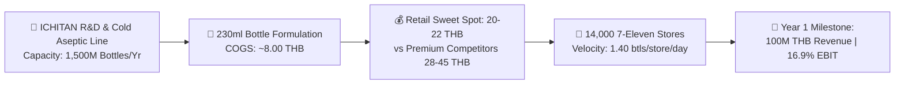
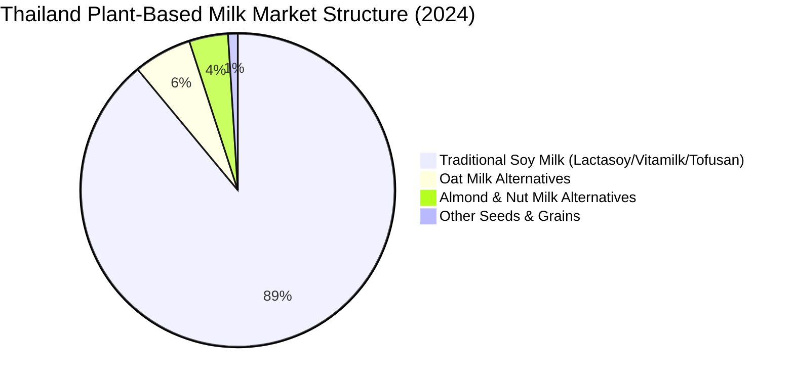
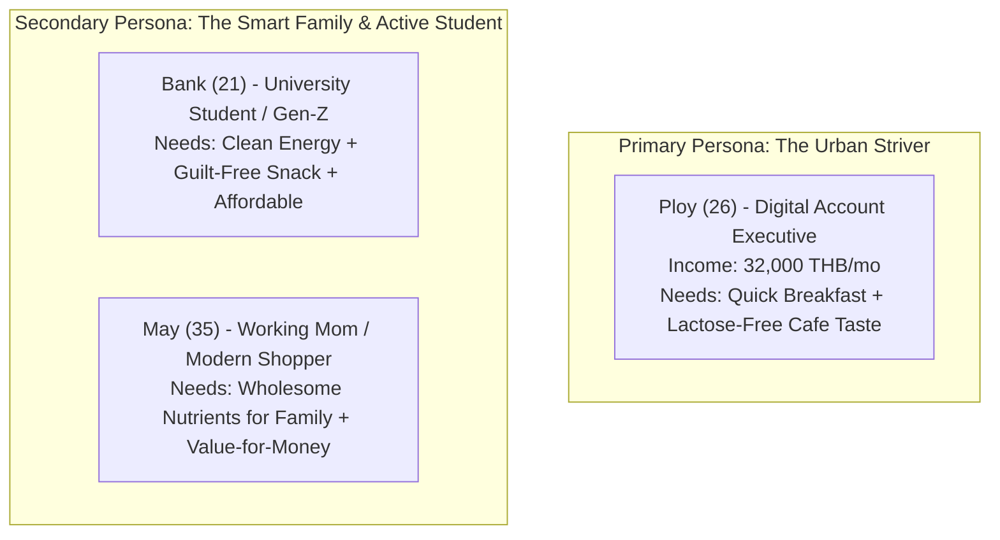
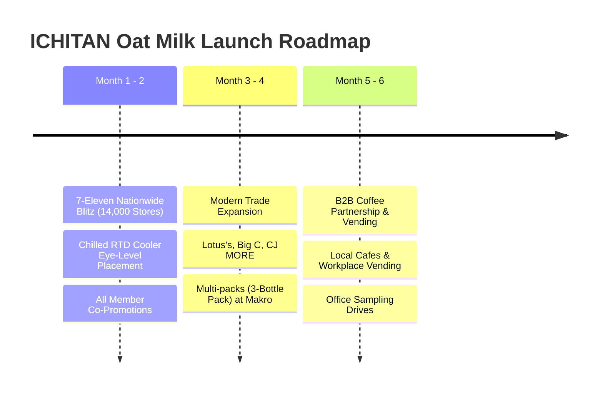
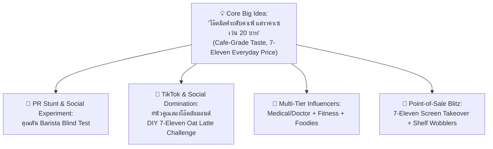

# 🌾 ICHITAN OAT MILK RTD LAUNCH
## Comprehensive Market Intelligence, Competitor Benchmarking & Strategic Feasibility Report
**Document Code:** ICH-STRAT-OAT-2026-v1  
**Project:** Project Golden Grain (ICHITAN Oat Milk RTD 230ml)  
**Target Revenue:** 100,000,000 THB (Year 1 Net Sales)  
**Classification:** STRICTLY CONFIDENTIAL & PROPRIETARY — FOR EXECUTIVE COMMITTEE & CEO REVIEW  
**Language:** Bilingual Executive Briefing (Thai & English)

---

## EXECUTIVE SUMMARY / บทสรุปผู้บริหารระดับสูง

| หัวข้อ (Dimension) | รายละเอียดเชิงกลยุทธ์ (Strategic Summary) |
| :--- | :--- |
| **Product Specifications** | **230 ml Ergonomic PET Bottle** (เทคโนโลยี Aseptic Cold Filling ปลอดเชื้อ ไม่ใช้วัตถุกันเสีย) |
| **Launch Flavors** | **1) Original Oat** (โอ๊ตธรรมชาติ หอมนุ่ม รสกลมกล่อม) <br> **2) Oat + Almond Blend** (โอ๊ตผสานอัลมอนด์ นัวเข้มข้น วิตามินอีสูง) |
| **COGS Benchmark** | **8.00 THB / Bottle** (วัตถุดิบโอ๊ตออสเตรเลีย + อัลมอนด์พรีเมียม + บรรจุภัณฑ์ขวด PET Aseptic) |
| **Target Retail Price (RSP)** | **20 – 22 THB** (Sweet Spot ในตู้แช่ Modern Trade ต่ำกว่าคู่แข่งนมโอ๊ต 30–40%) |
| **Year 1 Revenue Target** | **100.00 ล้านบาท (100 Million THB)** |
| **Volume Required (Yr 1)** | **~7.14 ล้านขวด/ปี** (คิดจาก Net Invoice Wholesale Price 14.00 บาท/ขวด ที่ราคาขายปลีก 22 บาท) |
| **7-Eleven Velocity Needed** | **เพียง 1.40 ขวด / สาขา / วัน** (กระจาย 14,000 สาขาทั่วประเทศ) หรือแยกเป็น **0.7 ขวด/รสชาติ/วัน** |
| **Key Competitive Edge** | ได้เปรียบด้านขนาดบรรจุ (230ml vs 180ml เพิ่มปริมาณ +28%), ความคุ้มค่าต่อมิลลิลิตร (0.096฿/ml vs 0.157฿/ml), และขวดฝาเกลียวดื่มสะดวก พกพาง่ายกว่ากล่อง UHT เจาะหลอด |



---

## DIMENSION 1: BUSINESS CHALLENGE (ความท้าทายทางธุรกิจ)

### 1.1 บริบทของอิชิตันและตลาดเครื่องดื่ม RTD
1. **ภาวะอิ่มตัวของตลาดชาพร้อมดื่ม (RTD Tea Maturity):** แม้อิชิตัน กรุ๊ป จะครองส่วนแบ่งการตลาดชาเขียวพร้อมดื่มอันดับต้นๆ และสร้างกระแสเงินสดที่แข็งแกร่งต่อเนื่อง แต่ตลาดชาเขียวเผชิญกับฤดูกาล (Seasonality) และความเสี่ยงจากภาษีความหวาน (Sugar Tax Phase Escalation) การสร้าง **เสาหลักธุรกิจใหม่ (New Growth Engine)** ในกลุ่มเครื่องดื่มสุขภาพที่ไร้ภาษีความหวานและมี Margin แข็งแกร่งจึงเป็นพันธกิจระดับองค์กร
2. **การใช้ประโยชน์จากสินทรัพย์โรงงาน (Asset Utilization):** โรงงาน "อิชิตัน กรีน แฟคทอรี่" ณ นิคมอุตสาหกรรมโรจนะ มีสายการผลิตแบบ **Aseptic Cold Filling** ที่เร็วและทันสมัยที่สุด มีกำลังการผลิตรวมกว่า 1,500 ล้านขวดต่อปี การขยายสู่หมวดนมพืช (Plant-Based RTD) ในบรรจุภัณฑ์ PET จะช่วยดูดซับต้นทุนคงที่ (Fixed Costs) และสร้าง Economy of Scale มหาศาล
3. **The Dairy Replacement Pivot:** คนไทยและชาวเอเชียกว่า **85–90% มีภาวะแพ้น้ำตาลแลคโตส (Lactose Intolerance)** ทำให้เกิดอาการท้องอืด แน่นท้อง หรือท้องร่วงเมื่อดื่มนมวัว ผู้บริโภคกำลังมองหานมทางเลือก แต่ทางเลือกในปัจจุบันยังมีข้อจำกัดชัดเจน

### 1.2 ข้อจำกัดของผู้เล่นในตลาดปัจจุบัน (The Pain Points)
* **กำแพงราคาที่สูงเกินเอื้อม (Price Barrier):** นมโอ๊ตและนมอัลมอนด์แบรนด์ปัจจุบัน (Oatly, Goodmate, 137 Degrees, Alpro) ถูกวางตำแหน่งเป็นสินค้านำเข้าหรือสินค้าเฉพาะกลุ่ม (Niche/Super-Premium) กล่องขนาด 180 มล. มีราคาขายปลีกอยู่ที่ 28 – 32 บาท และขนาด 1 ลิตร อยู่ที่ 110 – 135 บาท ซึ่งผู้บริโภคระดับ Mass ไม่สามารถซื้อดื่มได้ทุกวัน (Daily RTD)
* **นมถั่วเหลืองแบบดั้งเดิมเริ่มหมดมนต์ขลัง:** ตลาดนมถั่วเหลือง (Lactasoy, Vitamilk) ที่มีราคาถูก (10–15 บาท) กำลังเผชิญกับภาพลักษณ์น้ำตาลสูง กลิ่นถั่วเหลืองเฉพาะตัวที่บางคนไม่ชอบ และภาพจำของแบรนด์ยุคเก่าที่ไม่ตอบโจทย์ไลฟ์สไตล์คนรุ่นใหม่
* **ความท้าทายของอิชิตัน:** จะทำอย่างไรให้อิชิตันสามารถลบภาพลักษณ์เครื่องดื่มหวาน นำเสนอคุณค่าทางโภชนาการที่น่าเชื่อถือ และขยายฐานผู้บริโภคสู่นมโอ๊ตระดับ Mass ได้โดยคงอัตรากำไรขั้นต้น (Gross Margin) ไม่ต่ำกว่า 40–45%?

---

## DIMENSION 2: MARKET OPPORTUNITY & WHITE SPACE (โอกาสทางการตลาดและพื้นที่ว่าง)

### 2.1 ภาพรวมและขนาดตลาด (Market Size & Growth)
* **ตลาดนมพร้อมดื่มรวมในประเทศไทย (Total RTD Milk Market):** มีมูลค่าประมาณ **62,000 – 65,000 ล้านบาท**
* **ตลาดนมจากพืชรวม (Total Plant-Based Milk Market):** มีมูลค่าประมาณ **19,000 – 20,000 ล้านบาท** โดยกว่า 88–90% ยังคงเป็นนมถั่วเหลืองแบบดั้งเดิม
* **ตลาดนมพืชทางเลือกที่ไม่ใช่นมถั่วเหลือง (Alternative Plant-Based Milk - Oat, Almond, Pistachio):**
  - ปี 2021: ~1,200 ล้านบาท
  - ปี 2024: ~1,781 ล้านบาท
  - คาดการณ์ปี 2026: **ทะลุ 4,200 ล้านบาท** (เติบโตเฉลี่ย 18–25% ต่อปี จากศูนย์วิจัยกสิกรไทย)
  - โดยเซกเมนต์ **"นมข้าวโอ๊ต (Oat Milk)" มีอัตราการเติบโต YoY สูงที่สุด (+35% ถึง +45%)** แซงหน้านมอัลมอนด์ เนื่องจากเนื้อสัมผัสที่ครีมมี่ รสชาติเป็นกลาง เข้ากับเครื่องดื่มกาแฟได้ดีเลิศ และไม่มีสารก่อภูมิแพ้กลุ่มถั่วเปลือกแข็ง



### 2.2 Deep Competitor Benchmarking Matrix (การเปรียบเทียบคู่แข่งเชิงลึก)

| แบรนด์ (Brand) | ผู้ผลิต/นำเข้า | รูปแบบบรรจุภัณฑ์ (Format) | ปริมาตร (ml) | ราคาขายปลีก (RSP THB) | **ราคาต่อ ml (THB/ml)** | ช่องทางหลัก (Main Channels) | จุดเด่น (Strengths) | จุดอ่อน/ช่องว่างสำหรับอิชิตัน (Vulnerabilities) |
| :--- | :--- | :--- | :---: | :---: | :---: | :--- | :--- | :--- |
| **Oatly** | นำเข้า (สวีเดน/สิงคโปร์) | UHT Tetra Brik (กล่อง) | 250 ml | 42.00 ฿ | **0.168 ฿** | Tops, Gourmet, คาเฟ่, 7-11 บางสาขา | Global Brand Pioneer, ภาพลักษณ์แฟชั่น | ราคาสูงมาก (42฿), เป็นสินค้านำเข้า, ไม่ใช่เครื่องดื่ม everyday RTD |
| **Goodmate** | บจก. ชบาบางกอก | UHT Tetra Brik (กล่อง) | 180 ml | 28.33 ฿ *(แพ็ก 85฿/3)* | **0.157 ฿** | 7-Eleven, ซูเปอร์มาร์เก็ต | ผู้นำนมโอ๊ตไทย, ข้าวโอ๊ตออสเตรเลีย, กลมกล่อม | กล่องเล็ก 180ml รู้สึกหมดเร็ว, ราคายังสูงกว่า 25฿, กล่องเจาะหลอดปิดไม่ได้ |
| **137 Degrees** | บจก. ซิมเพิ้ล ฟู้ดส์ | UHT Tetra Brik (กล่อง) | 180 ml | 29.00 – 32.00 ฿ | **0.161 – 0.178 ฿** | 7-Eleven, Modern Trade | เจ้าแรกในตลาดนมอัลมอนด์/ถั่ว, ภาพลักษณ์คลีน 100% | รสถั่วชัดเจน/เน้นสายคลีนจัด ดื่มยากสำหรับคนทั่วไป, ราคาแตะ 30฿ |
| **UFC Velvet Oat** | บมจ. อาหารสากล (UFC) | UHT Tetra Brik (กล่อง) | 180 ml | 23.00 – 24.00 ฿ *(แพ็ก 67฿/3)* | **0.128 ฿** | Lotus's, Big C, 7-11 บางสาขา | ราคาเข้าถึงง่ายในกลุ่มนมโอ๊ตกล่อง, เสริมแคลเซียม | การกระจายสินค้าใน 7-Eleven ยังไม่ครอบคลุม, แบรนด์ดูเป็น FMCG วัตถุดิบทำอาหาร |
| **Tofusan (โทฟุซัง)** | บจก. โทฟุซัง | ขวดพลาสติกพาสเจอร์ไรส์ / UHT | 225 ml | 15.00 ฿ | **0.067 ฿** | 7-Eleven (Chilled shelf), Modern Trade | รสชาติสดใหม่, ครองใจคนทำงาน, ราคาถูก 15฿ | เป็นน้ำเต้าหู้/นมถั่วเหลือง ไม่ใช่นมโอ๊ตแท้, อายุสินค้าสั้น (แบบพาสเจอร์ไรส์) |
| **Lactasoy / Vitamilk**| แลคตาซอย / กรีนสปอต | UHT กล่องกระดาษ / ขวดแก้ว | 250 – 300 ml | 12.00 – 14.00 ฿ | **0.040 – 0.047 ฿** | กระจายทั่วประเทศทุกช่องทาง | ความคุ้มค่าระดับตำนาน, เข้าถึงทุกกลุ่มผู้บริโภค | น้ำตาลสูง, รสชาติหวานเลี่ยน, ภาพลักษณ์แบรนด์เก่า, ไม่ใช่นมโอ๊ต |
| **⭐ ICHITAN OAT MILK (New)** | **บมจ. อิชิตัน กรุ๊ป** | **ขวด PET Aseptic (ฝาเกลียว)** | **230 ml** | **20.00 – 22.00 ฿** | **0.087 – 0.096 ฿** | **14,000+ 7-Eleven, Lotus's, CJ, Makro** | **ปริมาณจุใจ 230ml (+28% vs 180ml), ราคา 20-22฿ ถูกกว่า 30-40%, ขวดฝาเกลียวพกพาสะดวก, เทคโนโลยีสกัดโอ๊ต+อัลมอนด์นัวพิเศษ** | **แบรนด์ใหม่ในตลาดนม ต้องเร่งสร้างความน่าเชื่อถือด้านสารอาหารและชวนชิม (Trial)** |

### 2.3 การวิเคราะห์ Price per ml: The Consumer Math

```
[Price per Milliliter Comparison]
Oatly 250ml:        ████████████████████ 0.168 ฿/ml
137 Degrees 180ml:  ██████████████████ 0.161 ฿/ml
Goodmate 180ml:     ██████████████████ 0.157 ฿/ml
UFC Velvet 180ml:   ███████████████ 0.128 ฿/ml
⭐ ICHITAN (22฿):    ███████████ 0.096 ฿/ml  <-- SWEET SPOT
⭐ ICHITAN (20฿):    ██████████ 0.087 ฿/ml   <-- DISRUPTIVE
Tofusan Soy 225ml:  ████████ 0.067 ฿/ml
Lactasoy Soy 300ml: █████ 0.040 ฿/ml
```

* **Insight:** ในขณะที่ Goodmate และ 137 Degrees ตั้งราคาต่อมิลลิลิตรไว้สูงถึง **0.157 – 0.161 บาท/ml** เพื่อจับกลุ่มพรีเมียม อิชิตันเปิดเกมราคาที่ **0.087 – 0.096 บาท/ml** ซึ่งต่ำกว่าคู่แข่งนมโอ๊ตในตลาดถึง **39% – 45%** ขณะเดียวกันให้ปริมาตรถึง **230 มล.** ซึ่งมากกว่ากล่อง 180 มล. ถึง **+27.8%** ทำให้เกิดจิตวิทยาความคุ้มค่า (Value-for-Money Perception) ขั้นสูงสุด

### 2.4 The Strategic White Space (ช่องว่างทางการตลาด)
1. **The "20–25 THB Chilled Grab-and-Go" Gap:**
   - ใต้ 15 บาท: นมถั่วเหลืองหวานทั่วไปและนมเปรี้ยว
   - ช่วง 20–25 บาท: **พื้นที่ว่างของนมโอ๊ตคุณภาพสูง** ในตู้แช่ 7-Eleven ที่ผู้บริโภคหยิบจ่ายได้โดยไม่ต้องคิด (Impulse Price Point)
   - เหนือ 28–35 บาท: กลุ่มนมโอ๊ต/นมอัลมอนด์พรีเมียมที่อัตราการหมุนเวียนสินค้า (Velocity) ต่อวันช้ากว่า
2. **The "Dual-Grain Fusion" White Space (Oat + Almond):**
   - ในตลาดมีแต่นมโอ๊ตเพียว หรือนมอัลมอนด์เพียว
   - **จุดอ่อนของนมโอ๊ตเพียว:** บางคนรู้สึกว่าแป้งเยอะและหวานคาร์โบไฮเดรต
   - **จุดอ่อนของนมอัลมอนด์เพียว:** รสสัมผัสบาง (Watery body) และกลิ่นถั่วอาจแรงเกินไป
   - **การผสมผสาน Oat + Almond:** ข้าวโอ๊ตให้ความเนียนนุ่มครีมมี่บอดี้แน่น ขณะที่อัลมอนด์เพิ่มกลิ่นหอมนัว (Nutty Aroma), โปรตีน, ไขมันดี และวิตามินอีสูง สร้างรสชาติ "นัวคูณสอง" ที่ไม่มีใครในตลาดทำในราคานี้

---

## DIMENSION 3: BRAND & PRICE POSITIONING (การวางตำแหน่งแบรนด์และราคา)

### 3.1 Brand Positioning Statement
> **"ICHITAN OAT MILK คือ เครื่องดื่มนมโอ๊ตพร้อมดื่มระดับคาเฟ่ ที่ส่งมอบคุณค่าทางโภชนาการและความอร่อยนัวกลมกล่อม ในบรรจุภัณฑ์ขวดพกพาสะดวก 230 มล. ด้วยราคาที่คนไทยทุกคนดื่มได้ทุกวัน เพียง 20–22 บาท"**

```
               [PREMIUM PRICE (30 - 45฿)]
                          |
             Oatly (Imported)
                          |   Goodmate (180ml)
                          |   137 Degrees (180ml)
                          |
[NICHE / SPECIALTY] ------+------------------- [MASS REFRESHMENT]
                          |
                          |   ⭐ ICHITAN OAT MILK (230ml @ 20-22฿)
                          |   (High Volume, Delicious, Everyday Drink)
                          |
       Tofusan (225ml @ 15฿)|
       Lactasoy (300ml @ 12฿)|
                          |
               [LOW PRICE (10 - 15฿)]
```

### 3.2 Product Architecture & Flavor Lineup

```
┌────────────────────────────────────────────────────────────────────────┐
│                     ICHITAN OAT MILK (230 ml PET)                      │
├───────────────────────────────────┬────────────────────────────────────┤
│     FLAVOR 1: ORIGINAL OAT        │    FLAVOR 2: OAT + ALMOND BLEND    │
├───────────────────────────────────┼────────────────────────────────────┤
│ • 100% Australian Rolled Oats     │ • Golden Oat Base + California     │
│ • รสชาติ: หอมกลิ่นข้าวโอ๊ตคั่วอ่อนๆ  │   Almond Paste                     │
│   นุ่มละมุน หวานธรรมชาติ ไม่เติม     │ • รสชาติ: "นัวเข้มข้น หอมกรุ่นถั่ว   │
│   น้ำตาลทราย (No Cane Sugar)      │   อัลมอนด์คั่ว" ความเข้มข้นแบบ     │
│ • สารอาหารเด่น:                     │   Barista-Grade                    │
│   - Beta-Glucan 1,000 mg/ขวด      │ • สารอาหารเด่น:                     │
│     (ช่วยลดระดับคอเลสเตอรอล)        │   - Vitamin E สูง 50% Thai RDI     │
│   - ใยอาหารสูง (High Dietary Fiber)│     (ต้านอนุมูลอิสระ บำรุงผิวพรรณ)    │
│   - แคลเซียมสูง 30% Thai RDI       │   - 0% Cholesterol                 │
│ • Target: กลุ่มคนแพ้นมวัว, สายเฮลท์ตี้│   - แหล่งโปรตีนและไขมันดี (MUFA)   │
│   ดื่มแทนอาหารเช้า หรือคู่กาแฟ        │ • Target: คนชอบความมันนัว, ดื่มเพลิน│
│                                   │   บ่ายคลายหิว, Guilt-free Snacking │
└───────────────────────────────────┴────────────────────────────────────┘
```

### 3.3 Packaging Format: PET Bottle vs UHT Carton
ทำไมต้องเป็น **ขวด PET Aseptic 230 ml (ฝาเกลียว)** แทนกล่องกระดาษ UHT?
1. **On-the-Go Lifestyle Advantage:** กล่อง UHT เจาะหลอดเมื่อดูดแล้วต้องดูดให้หมด พกพาใส่กระเป๋ายาก มีโอกาสหก ขณะที่ขวด PET ฝาเกลียวเปิดดื่ม ปิดฝา แช่เย็นต่อ หรือพกพาใส่กระเป๋าได้อย่างมั่นใจ
2. **The "DIY Coffee Companion" Use Case:** ผู้บริโภคใน 7-Eleven สามารถซื้อกาแฟสด All Cafe (Espresso Shot) แล้วเปิดฝาขวดเทผสมเป็น **"Oat Milk Latte"** หรือ **"Almond Oat Latte"** ได้ทันทีโดยไม่เลอะเทอะ
3. **Shelf Presence & Visual Appetite Appeal:** ขวดรูปทรงเว้าจับถนัดมือพร้อมฉลาก Full Shrink Sleeve ผิวด้าน (Matte Finish) โทนสี Warm Earth Tone (สีครีมข้าวโอ๊ต และสีน้ำตาลทองอัลมอนด์) ดูพรีเมียม โดดเด่นกว่ากล่องกระดาษทรงเหลี่ยมแบบเดิม

---

## DIMENSION 4: TARGET CONSUMERS & BUYER PERSONAS (กลุ่มผู้บริโภคเป้าหมาย)



### 4.1 Primary Persona: "Ploy, The Health-Conscious Urban Striver"
* **Demographics:** หญิง อายุ 24–32 ปี ทำงานบริษัทเอกชน/ออฟฟิศในย่าน CBD กรุงเทพฯ หรือหัวเมืองใหญ่ เงินเดือน 28,000 – 45,000 บาท
* **Psychographics:** ให้ความสำคัญกับบุคลิกภาพ สุขภาพ และเวลา เร่งรีบในชั่วโมงเช้า มีอาการท้องอืดง่ายเมื่อดื่มกาแฟใส่นมวัว ชอบดื่มกาแฟโอ๊ตมิลค์ตามคาเฟ่ แต่รู้สึกว่าการจ่ายเพิ่ม +20 ถึง +30 บาทต่อแก้วทุกวันเป็นภาระค่าใช้จ่ายเกินไป
* **Buying Behavior:** เข้า 7-Eleven สัปดาห์ละ 5–7 วัน มองหาของรองท้องมื้อเช้าที่เร็ว อิ่มท้อง แคลอรี่ไม่สูง และช่วยคุมน้ำหนัก
* **Job to be Done (JTBD):** "ขอนมที่ดื่มแล้วสบายท้อง ไม่แน่นพุง อร่อยเนียนนุ่มเหมือนสั่งจากคาเฟ่ ในราคา 20 กว่าบาท ที่ฉันซื้อดื่มได้ทุกวันโดยไม่รู้สึกผิดกับกระเป๋าเงิน"

### 4.2 Secondary Persona: "Bank, The Smart Gen-Z Creator & Student"
* **Demographics:** ชาย/หญิง อายุ 18–23 ปี นักศึกษามหาวิทยาลัย / First Jobber งบประมาณจำกัดแต่ชื่นชอบเทรนด์ใหม่ๆ
* **Psychographics:** เสพสื่อ TikTok ชื่นชอบสินค้าที่มีสตอรี่ Plant-Based สนใจสิ่งแวดล้อม ชอบลองของใหม่ในเซเว่น ชอบขนมหวานแต่กังวลเรื่องน้ำตาลและสิว
* **Buying Behavior:** ดื่มเป็นของว่างยามบ่าย (3 PM Snack Attack) หรือดื่มก่อนเข้าฟิตเนส/อ่านหนังสือสอบ
* **Job to be Done (JTBD):** "เครื่องดื่มอร่อยนัวฟินๆ กลิ่นอัลมอนด์โอ๊ต ดื่มแล้วสดชื่น มีประโยชน์ ไม่ทำให้อ้วนหรือสิวขึ้น แถมถ่ายคลิปรีวิวลง TikTok ได้เก๋ๆ"

---

## DIMENSION 5: STRATEGY FOR LAUNCH & GO-TO-MARKET (กลยุทธ์การเปิดตัวและช่องทาง)

### 5.1 ช่องทางการจัดจำหน่าย (Phased Channel Strategy)



#### Phase 1: 7-Eleven Exclusive Blitz (เดือนที่ 1 – 2)
* **ร้านค้าเป้าหมาย:** 14,000+ สาขาทั่วประเทศ
* **ตำแหน่งเชลฟ์ (Planogram):** ตู้แช่เย็นเครื่องดื่ม (Chilled Cooler) ชั้นระดับสายตา (Eye-Level) โซนเดียวกับ Tofusan และ High-Protein Milk
* **Facing Commitment:** ขั้นต่ำ 2 Facings ต่อสาขา (1 Facing สำหรับ Original Oat + 1 Facing สำหรับ Oat + Almond)
* **Speed to Shelf:** กระจายสินค้าเต็ม 100% สาขาภายใน 14 วัน ผ่านศูนย์กระจายสินค้า CP ALL (DC)

#### Phase 2: Mass Modern Trade & Suburban Expansion (เดือนที่ 3 – 4)
* **Lotus's (Hypermarket & Go Fresh) & Big C:** เจาะกลุ่มแม่บ้านและคนทำงานชานเมือง
* **CJ Express & CJ MORE:** ช่องทางยุทธศาสตร์สำคัญที่เข้าถึงชุมชนและตำบลรอบนอก ซึ่งคู่แข่งนมโอ๊ตพรีเมียมอย่าง Oatly/Goodmate ยังเข้าไม่ถึง
* **Makro:** วางจำหน่ายรูปแบบแพ็ก 6 ขวด และแพ็ก 12 ขวด เพื่อตอบโจทย์ร้านโชห่วยและผู้บริโภคที่ซื้อตุนในครัวเรือน (Pantry Loading)

### 5.2 กลยุทธ์กระตุ้นการทดลองดื่ม (Trial Generation Tactics)
1. **The "All Cafe Smart Combo" (มื้อเช้าอิ่มคุ้ม):**
   - แคมเปญร่วมกับ 7-Eleven: ซื้อ Espresso Shot จาก All Cafe (หรือแซนด์วิช/โอนิกิริ) รับสิทธิ์แลกซื้อ ICHITAN Oat Milk ในราคาเพียง **15 บาท**
2. **The 500,000 Bottles Office Troop Sampling:**
   - คาราวานแจกชิม 500,000 ขวด ใน 10 เขตออฟฟิศหลักของกรุงเทพฯ (สาทร, สีลม, อโศก, เพลินจิต, รัชดาภิเษก, พระราม 9, อารีย์, บางนา) และสถานี Interchange BTS/MRT ในชั่วโมงเร่งด่วน 07.30 – 09.30 น.
3. **LINE Points & 7-Eleven All Member Boost:**
   - สมาชิก All Member รับแต้มสะสมพิเศษ 100 แต้มทันทีเมื่อซื้อขวดแรก เพื่อดึงดูดกลุ่ม Early Adopters ให้ทดลองชิมทันทีตั้งแต่วันแรกที่วางขาย

---

## DIMENSION 6: INTEGRATED COMMUNICATION PLAN (IMC & CREATIVE HOOK)



### 6.1 Core Creative Concept & Key Message
* **Big Idea:** **"โอ๊ตมิลค์ระดับคาเฟ่ แต่ราคาเซเว่น แค่ 20 บาท"**
* **Key Visual Hook:** ภาพการเทนมโอ๊ตผสมอัลมอนด์ที่เข้มข้นนัวเนียน ฟองนมละเอียด ชนแก้วกาแฟสด เสียงแคะฝาเกลียว "เป๊าะ" พร้อมข้อความ: *"230 มล. เต็มอิ่ม นัวสะใจ ไม่ต้องจ่าย 40 บาท"*
* **Creative Slogan:**
  - *ภาษาไทย:* **"อิชิตัน โอ๊ตมิลค์ — โอ๊ตแท้นัวอัลมอนด์ ประโยชน์แน่น อร่อยเต็มขวดแค่ 20 บาท"**
  - *ภาษาอังกฤษ:* **"ICHITAN Oat Milk — Cafe-Grade Creaminess, Everyday 20 THB Price."**

### 6.2 Communication Touchpoints & Phasing

#### Wave 1: The Viral Social Experiment (D-Day ถึง สัปดาห์ที่ 2)
* **"คุณตัน Barista ปริศนา ณ สยามสแควร์":**
  - วิดีโอไวรัล Real-life Experiment: คุณตันสวมบทบาริสต้าปริศนา เสิร์ฟกาแฟลาเต้โอ๊ตอัลมอนด์ให้วัยรุ่นและคนทำงานชิม โดยถามว่า "คิดว่าแก้วนี้ใช้นมโอ๊ตราคาเท่าไหร่?" ผู้ร่วมทดลองตอบ 120–150 บาท
  - เฉลยตอนท้าย: นมขวดนี้ผลิตจากข้าวโอ๊ตออสเตรเลียและอัลมอนด์พรีเมียมจากอิชิตัน ราคาเพียง **20 บาท ที่ 7-Eleven ใกล้บ้านคุณ!** คาดการณ์ยอดรับชม Organic Reach 12+ ล้านวิวใน TikTok และ Facebook ภายใน 72 ชั่วโมง

#### Wave 2: Influencer Seeding & Health Education (สัปดาห์ที่ 3 ถึง สัปดาห์ที่ 8)
* **Tier 1 - Health & Nutrition Specialists:** แพทย์และนักโภชนาการสายวิทยาศาสตร์ (เช่น เพจ DoctorTop, ฟาสต์80/20, หมอสายสุขภาพ) อธิบายเจาะลึก:
  - ทำไมคนไทย 90% ท้องอืดจากนมวัว
  - ประโยชน์ของ Beta-Glucan ในการดักจับคอเลสเตอรอล
  - ทำไมการผสมข้าวโอ๊ตกับอัลมอนด์จึงให้วิตามินอีและไขมันดีสูงกว่านมข้าวทั่วไป
* **Tier 2 - Cafe & Lifestyle Creators:** กลุ่มบาริสต้าและ Cafe Hoppers ทำคอนเทนต์:
  - "Blind Test นมโอ๊ต 20 บาท ปะทะ นมโอ๊ตนำเข้า 45 บาท" (เน้นย้ำความนัวของสูตร Oat + Almond)
  - "สูตรลับเมนูประหยัด: DIY All Cafe Oat Latte จ่ายแค่ 38 บาท ได้รสชาติระดับสเปเชียลตี้"
* **Tier 3 - TikTok Community Challenge:** แฮชแท็ก `#โอ๊ตนัวคูณสอง` และ `#โอ๊ตเซเว่น20บาท` ให้ครีเอเตอร์ทำคลิปมิกซ์เครื่องดื่มสนุกๆ เช่น นมโอ๊ตผสมชาเขียวอิชิตัน หรือนมโอ๊ตผสมโกโก้

#### Wave 3: Retail Point of Sale (POSM) Domination
* สื่อโฆษณาหน้าจอ 7-Eleven Digital Screens กว่า 14,000 จุด ทั่วประเทศ ตอกย้ำภาพความสดชื่นและความคุ้มค่าขณะลูกค้ากำลังยืนรอชำระเงิน
* สติ๊กเกอร์ประตูตู้แช่ (Chiller Door Sticker) และป้าย Wobbler นำสายตาตรงจุดวางสินค้า

---

## DIMENSION 7: TIMELINE, FINANCIAL FEASIBILITY & 7-ELEVEN SHELF ECONOMICS

### 7.1 Detailed COGS Breakdown (การแจกแจงต้นทุนการผลิต 8.00 บาท)

```
[COGS Composition: 8.00 THB Total]
┌────────────────────────────────────────────────────────┬──────────┬────────┐
│ รายการต้นทุน (Cost Component)                          │ บาท/ขวด  │ สัดส่วน │
├────────────────────────────────────────────────────────┼──────────┼────────┤
│ 1. Australian Rolled Oat Base (Enzymatic Hydrolysis)   │ 2.40 ฿   │ 30.0%  │
│ 2. Almond Paste, Emulsifiers, Vitamins & Minerals      │ 1.35 ฿   │ 16.9%  │
│ 3. Primary Packaging (230ml PET Bottle, Cap, Sleeve)   │ 2.15 ฿   │ 26.9%  │
│ 4. Direct Manufacturing, Aseptic Utilities & Direct Labor│ 1.25 ฿ │ 15.6%  │
│ 5. Secondary Packaging (Corrugated Carton) & QA Testing│ 0.85 ฿   │ 10.6%  │
├────────────────────────────────────────────────────────┼──────────┼────────┤
│ TOTAL COGS PER 230 ML BOTTLE                           │ 8.00 ฿   │ 100.0% │
└────────────────────────────────────────────────────────┴──────────┴────────┘
```

* **Economy of Scale Advantage:** อิชิตันได้เปรียบผู้เล่นรายอื่นอย่างมากเนื่องจากมีเครื่องเป่าขวด PET ในโรงงานเอง (In-house Blow Molding) ร่วมกับสายการผลิต Aseptic Cold Filling ความเร็วสูงถึง 600–800 ขวด/นาที ทำให้ต้นทุนบรรจุภัณฑ์และค่าแปรรูปต่ำกว่าคู่แข่งที่สั่งผลิตแบบกล่อง UHT หรือนำเข้าสำเร็จรูปจากต่างประเทศถึง **25–35%**

---

### 7.2 Full Financial P&L Model to Achieve 100 Million THB Net Revenue

การประเมินทางการเงินแบ่งออกเป็น 2 มุมมองเพื่อให้คณะกรรมการบริหารและ CEO เห็นภาพที่ชัดเจนที่สุด:
* **Scenario A (Standard FMCG Corporate Metric):** ยอดขายสุทธิของอิชิตัน (Net Invoiced Revenue) = **100.00 ล้านบาท**
* **Scenario B (Retail Value Metric):** ยอดขายปลีกหน้าร้าน (RSP Consumer Spend Value) = **100.00 ล้านบาท**

```
═══════════════════════════════════════════════════════════════════════════════════════
                      ANNUAL P&L PROJECTION MODEL (YEAR 1)
═══════════════════════════════════════════════════════════════════════════════════════
ตัวแปรสมมติฐาน (Key Assumptions):
• ราคาขายปลีกแนะนำ (Recommended RSP incl. 7% VAT): 22.00 บาท / ขวด
• ราคาขายปลีกไม่รวมภาษีมูลค่าเพิ่ม (RSP Ex-VAT): 20.56 บาท / ขวด
• ส่วนลดการค้าและค่ากระจายสินค้า Modern Trade (Margin + DC + Rebate ~31.9%): 6.56 บาท / ขวด
• ราคาขายส่งสุทธิของอิชิตัน (Net Invoiced Price to Ichitan): 14.00 บาท / ขวด
• ต้นทุนขาย (COGS per bottle): 8.00 บาท / ขวด
• กำไรขั้นต้นต่อหน่วย (Gross Profit per bottle): 6.00 บาท / ขวด (42.86% of Net Sales)
═══════════════════════════════════════════════════════════════════════════════════════
```

| รายการทางการเงิน (Financial Line Items) | Scenario A (Net Invoiced Sales = 100M ฿) | สัดส่วน (% of Net) | Scenario B (Retail Value = 100M ฿) | สัดส่วน (% of Net) |
| :--- | :---: | :---: | :---: | :---: |
| **Retail Sales Value (มูลค่าขายปลีกหน้าร้าน)** | **157.14 ล้านบาท** | - | **100.00 ล้านบาท** | - |
| **ปริมาณขวดที่ต้องจำหน่าย (Bottles Sold)** | **7,142,857 ขวด** | - | **4,545,455 ขวด** | - |
| **ยอดขายสุทธิของอิชิตัน (Net Company Revenue)**| **100.00 ล้านบาท** | **100.0%** | **63.64 ล้านบาท** | **100.0%** |
| ต้นทุนสินค้าขายรวม (Total COGS @ 8.00 ฿/ขวด) | (57.14 ล้านบาท) | 57.1% | (36.36 ล้านบาท) | 57.1% |
| **กำไรขั้นต้นรวม (Gross Profit)** | **42.86 ล้านบาท** | **42.9%** | **27.28 ล้านบาท** | **42.9%** |
| ค่าใช้จ่ายการตลาดและโฆษณา (A&P / Marketing Budget)| (18.00 ล้านบาท) | 18.0% | (11.50 ล้านบาท) | 18.1% |
| ค่าขนส่ง โลจิสติกส์ และการขาย (Selling & Logistics ~5%)| (5.00 ล้านบาท) | 5.0% | (3.18 ล้านบาท) | 5.0% |
| ค่าใช้จ่ายบริหารและสนับสนุน (G&A Allocation ~3%) | (3.00 ล้านบาท) | 3.0% | (1.91 ล้านบาท) | 3.0% |
| **กำไรจากการดำเนินงาน (Operating Profit / EBIT)**| **16.86 ล้านบาท** | **16.9%** | **10.69 ล้านบาท** | **16.8%** |

#### บทวิเคราะห์ผลตอบแทนทางการเงิน (Financial Analysis):
1. **Gross Margin ที่แข็งแกร่ง (42.9%):** ด้วยต้นทุนการผลิต 8.00 บาท และราคาขายส่ง 14.00 บาท ทำให้อิชิตันมี Gross Margin สูงถึง 42.9% ซึ่งสูงกว่าเกณฑ์เฉลี่ยของกลุ่มเครื่องดื่มชาพร้อมดื่มทั่วไป (35–40%)
2. **งบการตลาดเชิงรุก (18 ล้านบาท ใน Scenario A):** งบประมาณ 18.0 ล้านบาท (18% ของยอดขายสุทธิ) เพียงพอสำหรับการทำ TVC/Online Media, สุ่มแจกตัวอย่าง 500,000 ขวด, Influencer กว่า 100 ช่อง, และสื่อหน้าร้าน 7-Eleven ครอบคลุมทั่วประเทศ
3. **ผลตอบแทน EBIT 16.86 ล้านบาท (16.9%):** นับเป็นโครงการเปิดตัวสินค้าใหม่ (New Category Entry) ที่สามารถสร้างกำไรสุทธิจากการดำเนินงานได้ทันทีตั้งแต่ปีแรก โดยไม่ต้องแบกรับผลขาดทุน

---

### 7.3 7-Eleven Shelf Economics: Velocity Analysis (การวิเคราะห์อัตราการหมุนเวียนสินค้าบนเชลฟ์)

คำถามสำคัญของผู้บริหาร: **"ต้องขายได้กี่ขวดต่อวันต่อสาขา จึงจะบรรลุเป้าหมาย 100 ล้านบาท?"**

#### ข้อมูลทางสถิติของช่องทาง 7-Eleven:
* จำนวนสาขา 7-Eleven ในประเทศไทย: **~14,000 สาขา**
* จำนวนวันใน 1 ปี: **365 วัน**
* ยอดวันเปิดทำการรวมของทุกสาขา (Total Store-Days): **14,000 × 365 = 5,110,000 Store-Days**

```
═══════════════════════════════════════════════════════════════════════════════════════
                      VELOCITY CALCULATION FORMULA
                      
  Required Bottles/Store/Day = Total Bottles Needed / (Number of Stores × 365 Days)
═══════════════════════════════════════════════════════════════════════════════════════
```

#### กรณีที่ 1: ยอดขายทั้งหมด 100 ล้านบาท เกิดขึ้นผ่าน 7-Eleven 100%
* เป้าหมายปริมาณขวด (Scenario A): **7,142,857 ขวด/ปี**
* อัตราการขายเฉลี่ยที่ต้องการต่อสาขาต่อวัน:
  $$\text{Velocity} = \frac{7,142,857 \text{ ขวด}}{5,110,000 \text{ Store-Days}} = \mathbf{1.398 \approx 1.40 \text{ ขวด / สาขา / วัน}}$$
* **การแบ่งยอดขายตาม 2 รสชาติ:**
  - **Original Oat:** ต้องการเพียง **0.70 ขวด / สาขา / วัน**
  - **Oat + Almond:** ต้องการเพียง **0.70 ขวด / สาขา / วัน**

#### กรณีที่ 2: การกระจายแบบสมจริง (7-Eleven 80% + Modern Trade อื่นๆ 20%)
* ยอดขายผ่าน 7-Eleven (80%): **5,714,286 ขวด/ปี**
* ยอดขายผ่าน Lotus's, CJ MORE, Big C, Makro (20%): **1,428,571 ขวด/ปี**
* อัตราการขายเฉลี่ยใน 7-Eleven จะลดลงเหลือเพียง:
  $$\text{Velocity} = \frac{5,714,286 \text{ ขวด}}{5,110,000 \text{ Store-Days}} = \mathbf{1.12 \text{ ขวด / สาขา / วัน}}$$

```
[Store Velocity Feasibility Benchmark]
Required Rate to Hit 100M THB: █ 1.40 btls/store/day
Typical Tofusan Velocity:      ██████ 8.0 - 12.0 btls/store/day
Typical RTD Green Tea:         ██████████ 15.0 - 25.0 btls/store/day
Goodmate Oat Milk 180ml:       ██ 2.5 - 4.0 btls/store/day
```

#### การจัดกลุ่มสาขาตามศักยภาพยอดขาย (Store Tiering Analysis)

| กลุ่มสาขา (Store Tier) | จำนวนสาขา (Stores) | ยอดขายคาดการณ์ (Bottles/Store/Day) | ยอดขายรวมต่อวัน (Bottles/Day) | ยอดขายรวมต่อปี (Bottles/Year) | คิดเป็นมูลค่ายอดขายสุทธิ (Net Revenue THB) |
| :--- | :---: | :---: | :---: | :---: | :---: |
| **Tier 1: High Density / CBD / Office / Uni** | 3,500 สาขา | **3.50 ขวด** | 12,250 ขวด | 4,471,250 ขวด | 62.60 ล้านบาท |
| **Tier 2: Residential / Suburban / Commuter** | 5,500 สาขา | **1.50 ขวด** | 8,250 ขวด | 3,011,250 ขวด | 42.16 ล้านบาท |
| **Tier 3: Provincial / Rural / Highway** | 5,000 สาขา | **0.60 ขวด** | 3,000 ขวด | 1,095,000 ขวด | 15.33 ล้านบาท |
| **รวมเฉพาะช่องทาง 7-Eleven** | **14,000 สาขา** | **1.68 ขวด (Avg)** | **23,500 ขวด** | **8,577,500 ขวด** | **120.09 ล้านบาท** |
| **บวกช่องทาง Modern Trade อื่นๆ (Lotus's/CJ)** | - | - | - | **1,500,000 ขวด** | **21.00 ล้านบาท** |
| **GRAND TOTAL POTENTIAL** | - | - | - | **10,077,500 ขวด** | **141.09 ล้านบาท** |

> [!IMPORTANT]
> **Executive Conclusion on Feasibility:**
> ตัวเลข **1.40 ขวด/สาขา/วัน** เป็นเกณฑ์ขั้นต่ำที่มีความเป็นไปได้สูงมาก (Extremely Conservative & Highly Achievable) เมื่อเทียบกับค่าเฉลี่ยของเครื่องดื่มเปิดตัวใหม่ใน 7-Eleven ที่มักหมุนเวียนอยู่ที่ 3–5 ขวด/สาขา/วัน และต่ำกว่ายอดขายของเจ้าตลาดนมถั่วเหลืองพาสเจอร์ไรส์อย่าง Tofusan ซึ่งขายได้เฉลี่ย 8–12 ขวด/สาขา/วัน หากแบรนด์อิชิตันทำยอดขายได้เพียง 1.68 ขวด/สาขา/วัน จะสามารถสร้างรายได้ทะลุเป้าหมายไปแตะที่ **120 – 141 ล้านบาท** ได้อย่างสบาย

---

### 7.4 Sensitivity Analysis (การวิเคราะห์ความอ่อนไหวต่อกำไรและราคา)

| ราคาขายปลีก (RSP) | ราคาขายส่งสุทธิ (Net Whsl) | COGS | Gross Margin (%) | Volume to hit 100M Net Sales | 7-11 Daily Velocity (All 14k stores) | Operating Profit (EBIT @ 18% A&P) |
| :---: | :---: | :---: | :---: | :---: | :---: | :---: |
| **20.00 ฿ (Aggressive)** | 12.80 ฿ | 8.00 ฿ | 37.5% | 7,812,500 ขวด | 1.53 ขวด/วัน | 11.50 ล้านบาท (11.5%) |
| **22.00 ฿ (Recommended)** | 14.00 ฿ | 8.00 ฿ | 42.9% | 7,142,857 ขวด | 1.40 ขวด/วัน | 16.86 ล้านบาท (16.9%) |
| **25.00 ฿ (Premium Margin)** | 16.00 ฿ | 8.00 ฿ | 50.0% | 6,250,000 ขวด | 1.22 ขวด/วัน | 24.00 ล้านบาท (24.0%) |

* **ข้อเสนอแนะเชิงกลยุทธ์:** แนะนำให้เลือก **ราคาขายปลีก 22.00 บาท** เป็นราคาตั้งต้น (Base Price) โดยอาจจัดโปรโมชั่นเปิดตัวช่วง 4 สัปดาห์แรก (Launch Intro Promo) ในราคาพิเศษ **20.00 บาท** เพื่อเร่งกระตุ้นการตัดสินใจซื้อครั้งแรก (Fast Trial) แล้วจึงปรับเข้าสู่ราคาปกติ 22.00 บาท ซึ่งยังคงถูกกว่าคู่แข่งในตลาดอย่าง Goodmate (28.33฿) และ 137 Degrees (29฿) อย่างมีนัยสำคัญ

---

## DIMENSION 8: RISK MATRIX & MITIGATION CONTROLS (ความเสี่ยงและการป้องกัน)

| ความเสี่ยง (Risk Factor) | ระดับผลกระทบ | โอกาสเกิด | แนวทางรับมือและป้องกัน (Mitigation Strategy) |
| :--- | :---: | :---: | :--- |
| **1. การเลียนแบบราคาจากคู่แข่ง (Price War)** | ปานกลาง | ปานกลาง | Goodmate และแบรนด์นำเข้าใช้กล่อง UHT ซึ่งมีโครงสร้างต้นทุนและค่าลิขสิทธิ์บรรจุภัณฑ์สูงกว่าระบบขวด PET Aseptic ของอิชิตัน ทำให้คู่แข่งลดราคาลงมาสู้ที่ 20–22 บาทได้ยากโดยไม่กระทบกำไรอย่างรุนแรง |
| **2. ความผันผวนของราคาข้าวโอ๊ตและอัลมอนด์** | ปานกลาง | ปานกลาง | ทำสัญญาซื้อขายวัตถุดิบล่วงหน้า (Long-term Forward Contracts 6–12 เดือน) กับซัพพลายเออร์ข้าวโอ๊ตในออสเตรเลียและอัลมอนด์ในสหรัฐอเมริกาเพื่อล็อกต้นทุน |
| **3. ภาพจำแบรนด์ชาเขียว/ความหวาน (Brand Perception)** | สูง | ปานกลาง | ดีไซน์ฉลากแยกเอกเทศ ใช้ Sub-brand ชัดเจน (เช่น *ICHITAN OAT-DAY* หรือ *ICHITAN GRAIN*) ตอกย้ำตราสัญลักษณ์ "ทางเลือกสุขภาพ" (Healthier Choice Logo), 0% คอเลสเตอรอล, ไม่เติมน้ำตาลทราย |
| **4. การแย่งพื้นที่ในตู้แช่ 7-Eleven (Chilled Shelf Congestion)**| สูง | สูง | ใช้ประโยชน์จากความสัมพันธ์ทางการค้าอันยาวนานของอิชิตันกับ CP ALL, มีข้อตกลง Guaranteed Minimum Velocity และงบ Co-Promotion ร่วมกับ All Cafe เพื่อรักษาพื้นที่ 2 Facings อย่างถาวร |

---

## DIMENSION 9: RECOMMENDATIONS FOR CEO & EXECUTIVE COMMITTEE (บทสรุปข้อเสนอแนะ)

1. **อนุมัติโครงการผลิตนำร่อง (Approve Pilot Run):** อนุมัติการปรับแต่งไลน์ Aseptic Cold Filling 1 ไลน์ ณ โรงงานโรจนะ เพื่อเตรียมผลิตขวดขนาด 230 ml พร้อมทดสอบสูตร (Trial Batch) ภายใน 45 วัน
2. **อนุมัติกรอบราคาขายปลีก 22 บาท (โปรโมชั่นเปิดตัว 20 บาท):** เพื่อสร้างแรงสะเทือนในตลาด (Market Disruption) และดึงดูดผู้บริโภคจากทั้งตลาดนมวัว นมถั่วเหลือง และนมโอ๊ตพรีเมียม
3. **อนุมัติกรอบงบการตลาด Launch Year 18.0 ล้านบาท:** เน้นจัดสรร 40% สำหรับการแจกชิมและโปรโมชั่นหน้าร้าน 7-Eleven, 35% สำหรับ Digital Video & TikTok Creators, และ 25% สำหรับสื่อนอกบ้านและ POSM
4. **กำหนดเป้าหมาย KPI ปีแรก:**
   - ยอดขายสุทธิ (Net Revenue): **100.00 ล้านบาท**
   - ปริมาณการจำหน่าย: **7.14 ล้านขวด**
   - อัตราการหมุนเวียนสินค้าเฉลี่ยใน 7-Eleven: **ไม่ต่ำกว่า 1.40 ขวด / สาขา / วัน**
   - กำไรจากการดำเนินงาน (EBIT): **ไม่ต่ำกว่า 16.86 ล้านบาท (EBIT Margin 16.9%)**

---
*รายงานฉบับนี้จัดทำโดยทีมกลยุทธ์การตลาดและพัฒนาธุรกิจ เพื่อใช้เป็นเอกสารประกอบการตัดสินใจของคณะกรรมการบริหาร บมจ. อิชิตัน กรุ๊ป*
